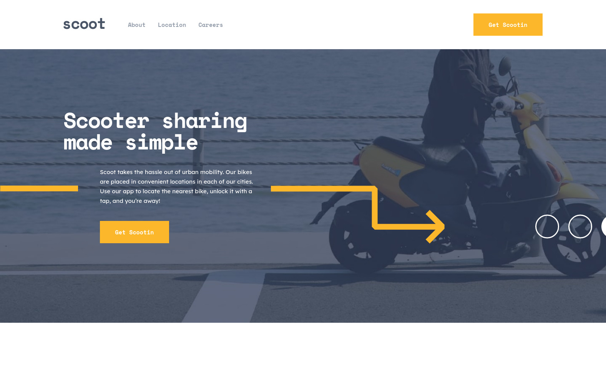

# Frontend Mentor - Scoot website solution

This is a solution to the [Scoot website challenge on Frontend Mentor](https://www.frontendmentor.io/challenges/scoot-multipage-website-N76alNPRJ).

## Table of contents

- [Overview](#overview)
  - [The challenge](#the-challenge)
  - [Screenshot](#screenshot)
  - [Links](#links)
- [My process](#my-process)
  - [Built with](#built-with)

## Overview

### The challenge

Users should be able to:

- View the optimal layout for each page depending on their device's screen size
- See hover states for all interactive elements throughout the site

### Screenshot

### Links

- [Solution](https://github.com/kxrn0/fem_scoot)
- [Live](https://kxrn0.github.io/fem_scoot)

## My process

### Built with

- Semantic HTML5 markup
- CSS custom properties
- Flexbox
- CSS Grid
- [React](https://reactjs.org/) - JS library
- [Styled Components](https://styled-components.com/) - For styles
